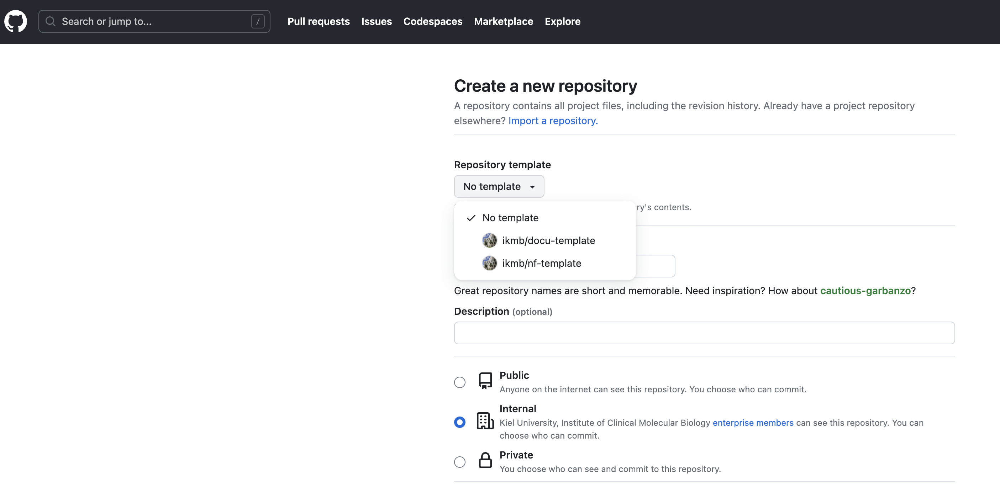

# Developer's guide

This document is a brief overview of how to use this code base. Some understanding of Nextflow and how it implements DSL2 is assumed. 

## Basic concept

This pipeline base is organized in the following way:

* `main.nf` - entry point into the pipeline, imports the core workflow from workflow/<pipeline>.nf
* `workflow/<pipeline.nf>` - the actual core logic of the pipeline; imports sub-workflows from subworkflow/<sub>.nf
* `subworkflow/<sub>.nf` - a self-contained processing chain that is part of the larger workflow (e.g. read alignment and dedup in a WGS calling workflow)
* `modules/<module>.nf` - A command line tool/call that can be imported into a (sub)workflow. 

## Groovy libraries

This pipeline imports a few functions into the nextflow files from lib/ - mostly to keep the actual pipeline code a bit cleaner/more readable. For example, 
the `--help` command line option can be found in lib/WorkflowMain.groovy. Likewise, you could use this approach to do some basic validation of your inputs etc. 

## Github workflows

Github supports the automatic execution of specific tasks on code branches, such as the automatic building and pushing of Docker containers. To add github workflows to your repository, rename the folder `dot_github` to `.github` and adjust the files therein accordingly (name of pipeline, docker repo etc).

### Docker containers

In order to automatically push Docker containers, you must add your docker username and API token as secrets to your repository (DOCKERHUB_USERNAME and DOCKERHUB_TOKEN). Secrets can be created under Settings/Secrets and Variables/Actions. Of course, you also need to have an account on Dockerhub and generate a permanent token.  

## How to start

1. Create a new repository and use this template 



2. Checkout the new repository

After checking out the repo, create a branch "dev" or "devel" as well as "main"

```
git branch devel
git branch main
```
With these branches created, switch to the devel branch and start developing.

```
git checkout devel
```

3. Go through the source files and address the sections marked with `//DEV`

- Update `nextflow.config' with the name and version of your pipeline, required nextflow version and so on
- Rename the main workflow file and workflow definition to match your pipeline topic (and update main.nf accordingly)
- If you want to provision a pipeline-specific Docker container
  - rename dot_github to .github
  - Create a dockerhub project for this pipeline
  - Update the github actions to the name of the dockerhub project 

  IMPORTANT: When you rename files in a git project, use `git mv`, not plain `mv` to avoid breaking the built-in file tracking of your git repo!

4. Outline your primary workflow logic in `workflow/<pipeline.nf>` 

5. Start outlining your subworkflows, if any, in `subworkflows/<subworkflow.nf>`

6. Build all the necessary modules in `modules/`, using `modules/fastp/main.nf` as a template
   - Use a subfolder for each software package and folders therein for sub-functions of a given tool (e.g. samtools)
   - Each module should include a `container` statement to specify which software container is to be used
   - Each module should collect information on the software version(s) of the tools used - see existing modules for examples. 

## How to test

It is very much recommended to implement a simple test suite for your pipeline. 

A default test profile is already included with this code base - you simply have to update the inputs. These inputs should consist of a highly reduced data set that 
can be processes in a very short amount of time. An example would be short read data from a small section of the genome only (which you could, for example, extract from a BAM file using 
coordinates). You get the idea. We try to keep test data in a [shared repository](https://github.com/ikmb/nf-testdata) - you might find something you can use in there, or you could add your own data set. Remember, git has a hard-limit of 50MB for individual files. 

To run the test, the syntax would be:

```
nextflow run my/pipeline -profile standard,test
```

Here, standard refers to the default site configuration ('standard') - change it if you need to run this pipeline under a different profile. 
